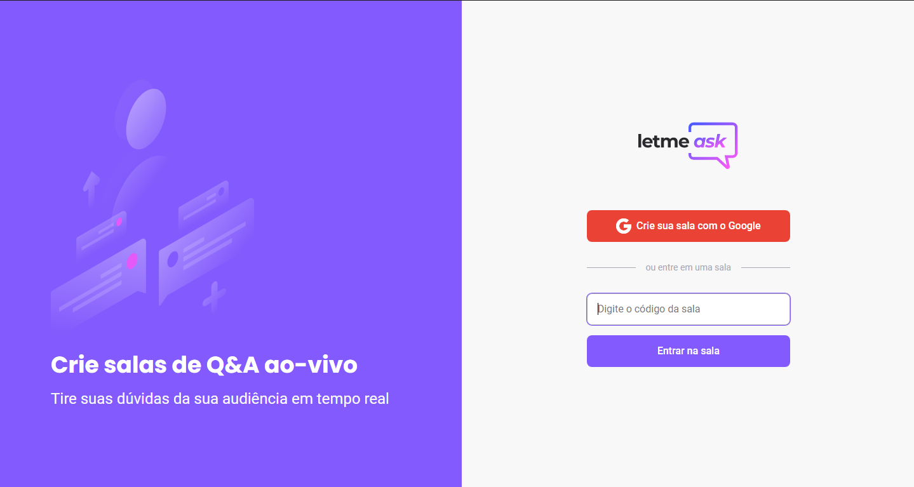
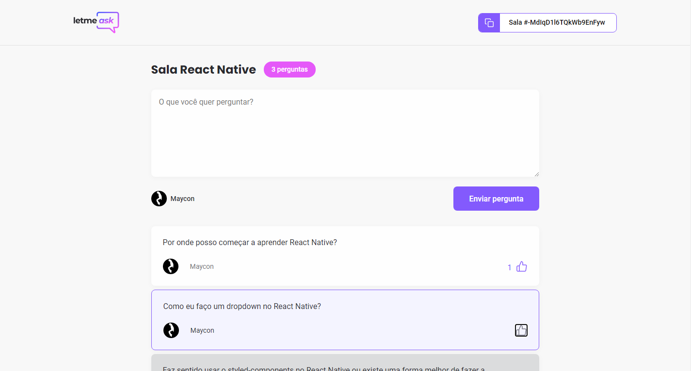
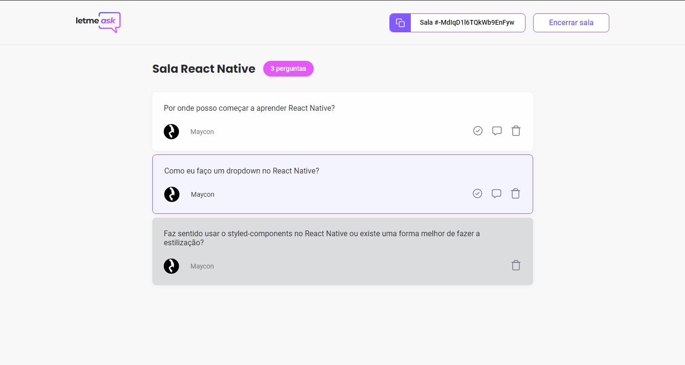

# ❔ Letmeask ❔

<h1 align="center">
  
  
</h1>
<h1 align="center">
  
  
</h1>

---

# 📄 About

The **Letmeask** project is an application that manages questions, highlighting, ranking it, for a better experience on asking and answering between people. It was developed during Next Level Week #06, by **RocketSeat**.

You can view this repo deployed by clicking [here](https://letmeask-19e44.web.app/).

---

# 🧰 Technologies used
- Frontend - **ReactJS**
  - typescript
  - axios
  - react-router-dom
  - sass
  - classnames
- Backend - **Firebase**
  - Realtime database
  - Authentication with google
  - Hosting

---

# 📚 Beyond the event
This section lists a bunch of features made in addition to the content of NLW.
  - [x] Responsiveness
  - [x] Modal
  - [x] Ranking questions by likes, highlighted and answered
  - [x] Logout header option
  - [x] Admin page header option
  - [x] Redirecting unauthorized user on admin page
  - [x] Admin page seeing likes
  - [x] Bug when liking not logged in

---

# 🏭 How to install/use

This section describes how to run this app locally at your environment, of course you can access the deployed version [here](https://letmeask-19e44.web.app/). For this you need to have `node` and `git` installed.

If you have `yarn` installed, you can replace `npm`. Open `cmd` and:
```bash
$ git clone https://github.com/m4ycon/letmeask.git
$ cd proffy/web
$ npm install
```

After this, you will need to set up your environment by creating a file `.env.local` at the root of your repository. Complete `...` with the respective `api_key`, `auth_domain`, ..., your firebase configuration.

```
# Firebase config
REACT_APP_API_KEY='...'
REACT_APP_AUTH_DOMAIN='...'
REACT_APP_DATABASE_URL='...'
REACT_APP_PROJECT_ID='...'
REACT_APP_STORAGE_BUCKET='...'
REACT_APP_MESSAGING_SENDER_ID='...'
REACT_APP_APP_ID='...'
```
And finally you can run `$ npm start` and access the app on `http://localhost:3000`


Happy hacking!

---

Made by Maycon Fabio 🚀